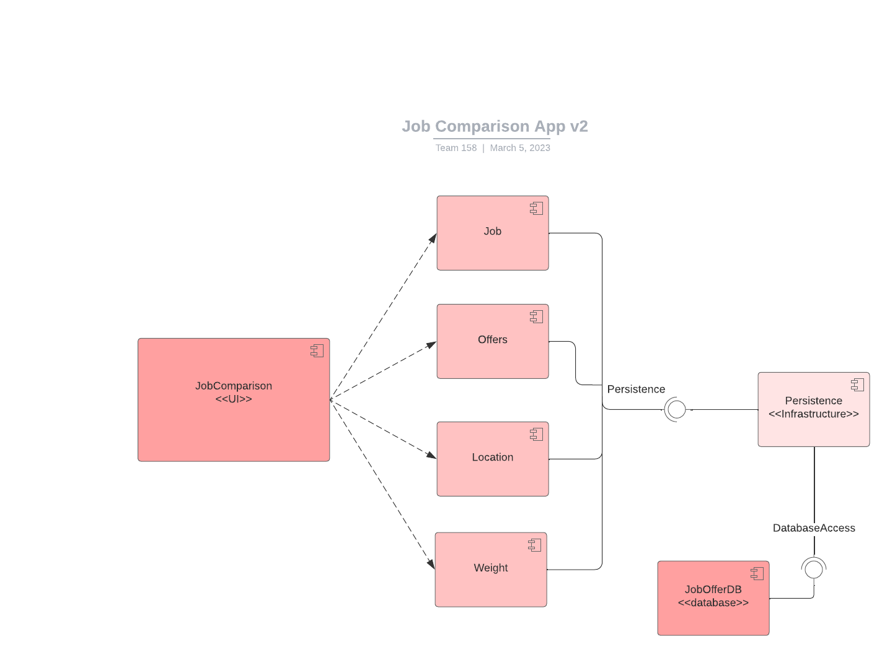
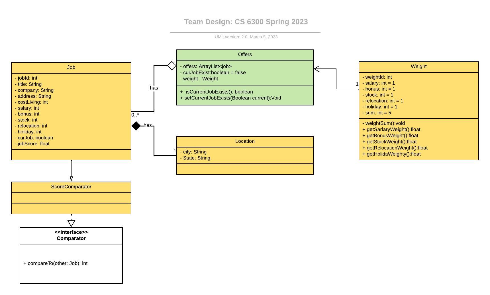
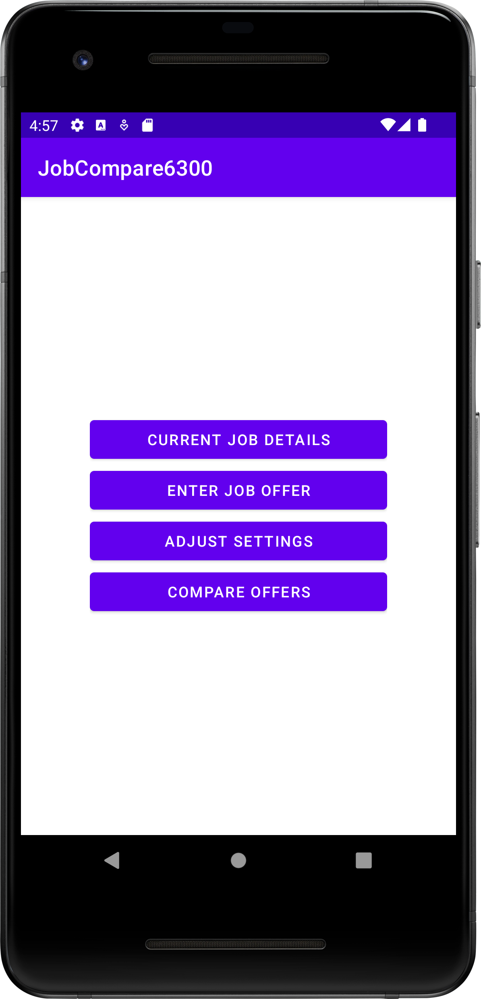
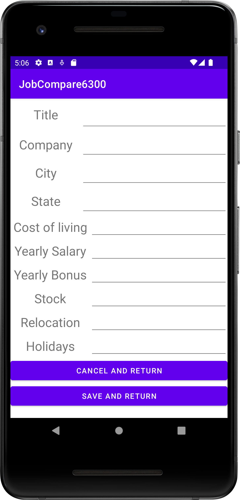
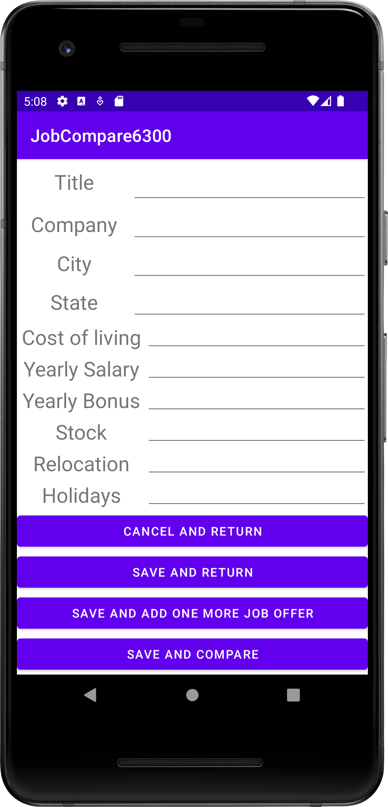
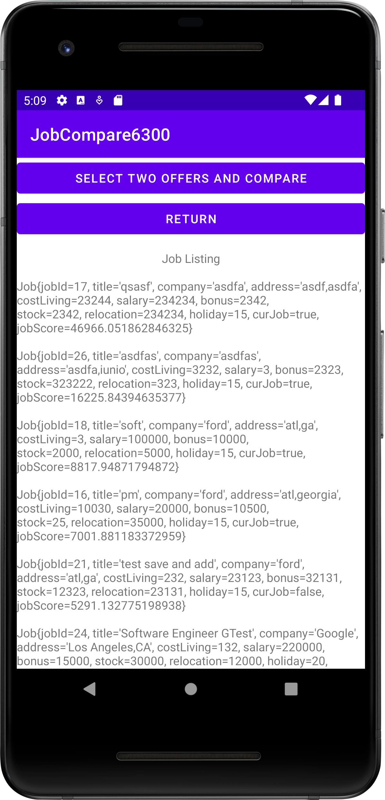
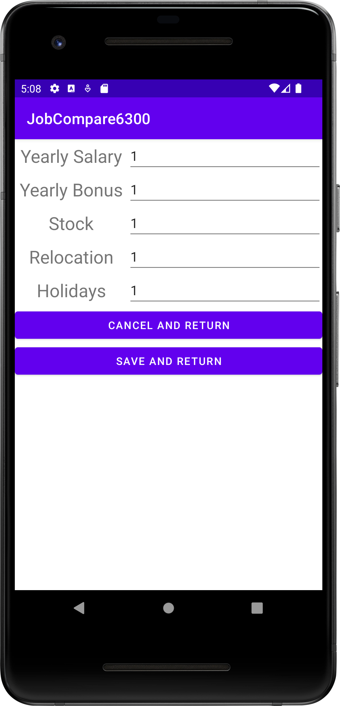

# Design Document

**Author**: Team 158
**Version**: V2

## 1 Design Considerations

### 1.1 Assumptions
* The application will be used by a single user.
* The application will be an Android application.
* The data will persist between sessions.
* There will be at least one job offer to search from within the app.
* Users will be able to enter duplicate job offers into the app.

#### 1.1.2 Dependencies
* Minimum SDK - API 31: Android 12
* JUnit v4.13.2 
* Androidx.test.ext:JUnit v1.1.3 
* Espresso:Espresso-core v3.4.0 
* Androidx.test:rules v1.4.0
* Room v2.5.0

### 1.2 Constraints
* The application must be run on a device that supports API 31: Android 12 at minimum.
* The application will only be able to support a single user.
* The application will only be available in English.

### 1.3 System Environment
* The hardware the application will run on is Android cellphones.
* The Androids will support software API 31 Android 12 at minimum.
* The application data will persist on a Room local database between runs.

## 2 Architectural Design

### 2.1 Component Diagram

* The below diagram is a software component diagram demonstrating the relationships between the UI and the component methods such as the Job, User, Location, and Weight class. It also portrays the persistence relationship with the database infrastructure.

### 2.2 Deployment Diagram

* A deployment diagram is unnecessary for the job offer comparison application because it is a simple, single user application with a local Room database and all of its components will be hosted locally within controlled application testing environments.
## 3 Low-Level Design

### 3.1 Class Diagram
* The below class diagram demonstrated class relationships and dependencies of the job offer application system. The diagram was created following the specifications for UML version 2.0.

## 4 User Interface Design

