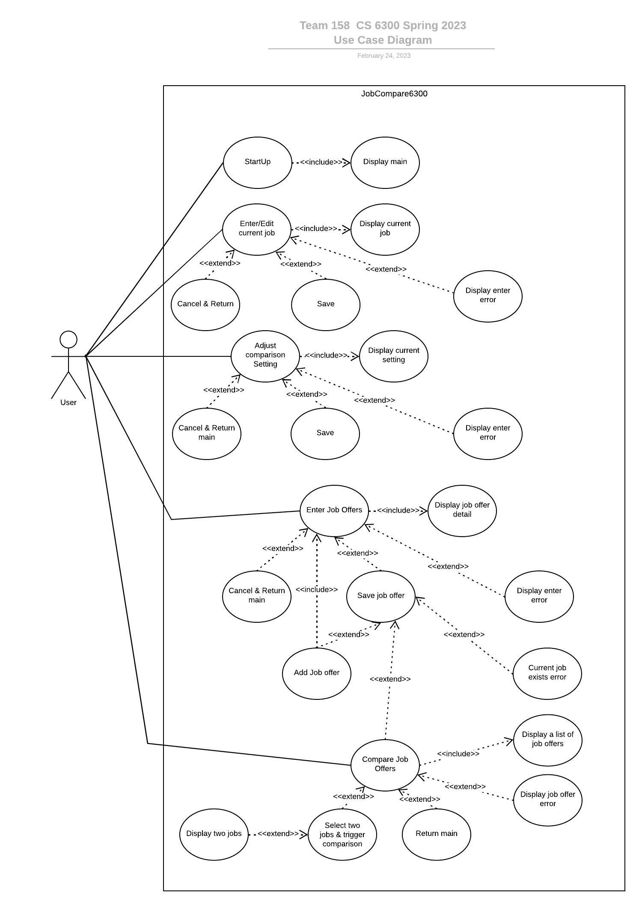

# Use Case Model JobCompare6300

**Author**: \<Team 158\>

## 1 Use Case Diagram

## 2 Use Case Descriptions

*Present Main Menu*

- *Requirements:  Allow the user to navigate to all other functionalities of the app.*
- *Pre-conditions: The app has been launched.*
- *Post-conditions The user is presented with the main menu.*
- *Scenarios 1. The app is launched.*
- *Scenarios 2. The main menu is presented.*
- *Scenarios 3. Options to (1) enter or edit current job details, (2) enter job offers, (3) adjust comparison settings, or (4) compare job offers.*

*Enter/Edit Current Job Details*

- *Requirements:  Allow the user to enter or edit details of their current job.
- *Pre-conditions: The user is on the main menu and chooses to enter or edit current job details.*
- *Post-conditions: The details of the current job are saved or discarded, and the user is returned to the main menu.*
- *Scenarios 1. The user selects the "Enter or Edit Current Job Details" option from the main menu.*
- *Scenarios 2. The user is presented with a user interface to enter or edit all details of their current job.*
- *Scenarios 3. The user enters or edits the details of their current job.*
- *Scenarios 4. The user selects either the "Save" or "Cancel" button.*
- *Scenarios 5. If the user selects "Save," the details of the current job are saved, and the user is returned to the main menu.Check all input correct, before save.*
- *Scenarios 6. If the user selects "Cancel," the details of the current job are not saved, and the user is returned to the main menu.*

*Enter Job Offers*

- *Requirements:  Allow the user to enter details of a job offer.*
- *Pre-conditions: The user is on the main menu and chooses to enter job offers.*
- *Post-conditions: The details of the job offer are saved or discarded, and the user is given the option to enter another offer, compare offers, or return to the main menu.*
- *Scenarios 1. The user selects the "Enter Job Offers" option from the main menu.*
- *Scenarios 2. The user is presented with a user interface to enter all details of the job offer.*
- *Scenarios 3. The user enters the details of the job offer.*
- *Scenarios 4. The user selects either the "Save" or "Cancel" button.*
- *Scenarios 5. If the user selects "Save" the details of the job offer are saved. Check all input correct, before save.*
- *Scenarios 6. After selecting "save", the user is given the option to (1) enter another offer, (2) compare offers, or (3) return to the main menu.*
- *Scenarios 7. If the user selects "Enter Another Offer," the app takes them back to Scenarios 2.*
- *Scenarios 8. If the user selects "Compare Offers," the app proceeds to Use Case "Compare Job Offers".*
- *Scenarios 9. If the user selects "Return to Main Menu," the app takes them back to the main menu.*

*Adjust Comparison Settings*

- *Requirements:  Allow the user to adjust the comparison settings for job offers.*
- *Pre-conditions: The user is on the main menu and chooses to adjust comparison settings.*
- *Post-conditions: The user's preference for comparison factors is saved, and the app takes them back to the main menu.*
- *Scenarios 1. The user selects the "Adjust Comparison Settings" option from the main menu.*
- *Scenarios 2. The user is presented with a user interface that allows them to assign integer weights to comparison factors *
- *Scenarios 3. The user assigns weights to the comparison factors, or leaves them all equal as value 1.*
- *Scenarios 4. The user selects the "Save" button. Check all input correct, before save.*
- *Scenarios 5. The user's preference for comparison factors is saved, and the app takes them back to the main menu.*

*Compare Job Offers*

- *Requirements:  Allow the user to compare job offers based on various factors and view a table comparing the job details of the two selected jobs.*
- *Pre-conditions: The user is on the main menu and chooses to enter job offers. Or the user is on the Enter Job Offers and chooses to compare offers after save a job offer*
- *Post-conditions: The user is presented with the main menu.*
- *Scenarios 1. User selects "Compare Job Offers" from the main menu.*
- *Scenarios 2. The system displays a list of job offers, ranked from best to worst, and including the current job (if present), clearly indicated.*
- *Scenarios 3. User selects two job offers to compare and triggers the comparison.*
- *Scenarios 4. The system displays a table comparing the job details of the two selected jobs.*
- *Scenarios 5. User is offered the option to perform another comparison or return to the main menu.*